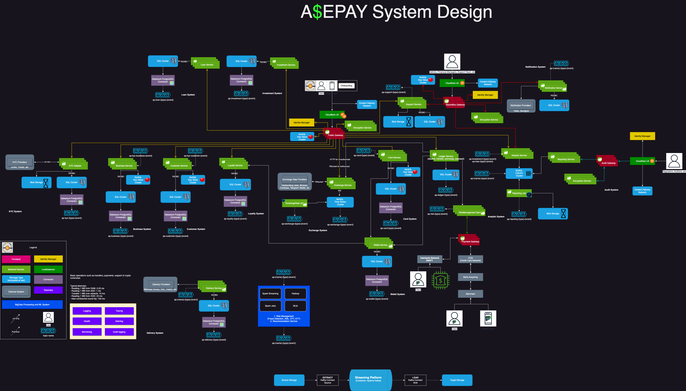

# ASEPAY Service
[](https://github.com/fragaLY/ase-pay-system/actions/workflows/ase-pay-service.yml)

## The ASEPAY system is the aggregator for different providers.

## System Design for the final solution

## How to run

Data is stored and handled by ELK. For caches could be used Redis, only Redis supports reactive caching. See docker-compose.local.yml:

```yml
version: "3.8"

services:

  postgres:
    image: postgres:16-alpine
    restart: always
    environment:
      POSTGRES_DB: ${PG_DB}
      POSTGRES_USER: ${PG_USER}
      POSTGRES_PASSWORD: ${PG_USER_PASSWORD}
    ports:
      - ${PG_PORT}:5432
    volumes:
      - ./data:/var/lib/postgresql/data
```

Feel free to run it to work localy. 
To boot up the application use ```./gradlew bootRun``` command or pull the image ```docker pull fragaly/asepay-system```.

See the Open Api documentation to be familiar with service API:

```yaml
openapi: "3.0.3"
info:
  title: "catalog_service API"
  description: "catalog_service API"
  version: "1.0.0"
servers:
  - url: "https://localhost:8080"
paths:
  /api/v1/equipments:
    get:
      summary: "GET api/v1/equipments"
      operationId: "get"
      parameters:
        - name: "parameters"
          in: "query"
          required: false
          schema:
            type: "string"
        - name: "page"
          in: "query"
          required: false
          schema:
            type: "integer"
            format: "int32"
            default: "0"
        - name: "size"
          in: "query"
          required: false
          schema:
            type: "integer"
            format: "int32"
            default: "20"
      responses:
        "200":
          description: "OK"
          content:
            '*/*':
              schema:
                type: "array"
                items:
                  $ref: "#/components/schemas/Equipment"
  /api/v1/data/process:
    post:
      summary: "POST api/v1/data/process"
      operationId: "process"
      requestBody:
        content:
          application/json:
            schema:
              type: "string"
      responses:
        "200":
          description: "OK"
          content:
            '*/*':
              schema:
                type: "array"
                items:
                  $ref: "#/components/schemas/Equipment"

components:
  schemas:
    BigDecimal:
      type: "object"
      properties: { }
    Equipment:
      type: "object"
      properties:
        id:
          type: "string"
        brandName:
          type: "string"
        details:
          type: "string"
        sizes:
          type: "array"
          items:
            type: "string"
        mrp:
          type: "string"
        sellPrice:
          $ref: "#/components/schemas/BigDecimal"
        discount:
          $ref: "#/components/schemas/BigDecimal"
        category:
          type: "string"
    DataProcessingPayload:
      type: "object"
      properties:
        uris:
          type: "array"
          items:
            type: "string"
            format: "uri"
```

### System Design


